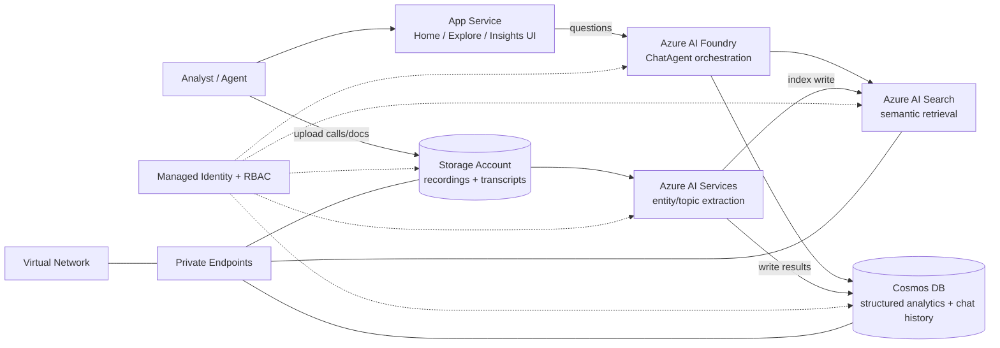

# Conversation Knowledge Mining (Call Center Copilot)

Derive actionable insights from large volumes of conversational/call data using generative AI -- extract key phrases, model topics, and enable interactive natural language exploration across conversations, documents, and recordings.

[**SOLUTION OVERVIEW**](#solution-overview) &nbsp;|&nbsp; [**RESOURCES DEPLOYED**](#resources-deployed) &nbsp;|&nbsp; [**BUSINESS SCENARIO**](#business-scenario) &nbsp;|&nbsp; [**SUPPORTING DOCUMENTATION**](#supporting-documentation)

> [!NOTE]
> This README is mocked/generated placeholder documentation for the `call-center` technical pattern.
> Its content/structure is modeled on: https://github.com/microsoft/Conversation-Knowledge-Mining-Solution-Accelerator

## Solution overview

Call recordings, transcripts, and related documents land in a Storage Account. An Azure AI Services account (Content Understanding-style extraction) pulls entities, topics, and relationships out of the conversations, which are then indexed in Azure AI Search for hybrid retrieval and written to Cosmos DB for structured analytics and chat history. An App Service hosts the agent-facing web experience -- a Chat/Explore surface that routes questions to an AI Foundry-hosted agent reasoning across both semantic search and structured data, and an Insights surface with an auto-generated, LLM-planned dashboard. Every service-to-service call uses a managed identity with least-privilege RBAC role assignments instead of keys, secrets live in Key Vault, and Storage/Cosmos DB/AI Search/AI Foundry sit behind private endpoints.

### Architecture

### How it works

Home -- upload call recordings, transcripts, or documents to the Storage Account, or load a sample scenario pack; processing runs in the background. Explore -- converse with your data through the App Service UI, which routes questions to an AI Foundry ChatAgent with two tools: Azure AI Search for semantic retrieval and Cosmos DB for structured analytics -- the agent reasons across both and returns grounded, cited answers. Insights -- the LLM reads the dataset's schema and plans an adaptive dashboard of KPIs and charts driven entirely by data, not hard-coded layouts.

### Additional resources

- [Azure AI Foundry documentation](https://learn.microsoft.com/azure/ai-foundry/)
- [Azure AI Search documentation](https://learn.microsoft.com/azure/search/)
- [Azure AI Content Understanding documentation](https://learn.microsoft.com/azure/ai-services/content-understanding/)

### Key features

Click to learn more about the key features this pattern enables

- Mined entities and relationships -- extracts entities, topics, and relationships from unstructured conversations to build a richer knowledge base.
- Processes high-volume conversation data at scale, generating embeddings and indexing results for fast hybrid retrieval.
- Visualized insights -- an interactive dashboard surfaces trends, distributions, and outliers.
- Natural language interaction -- ask contextual questions and get grounded, cited responses through an AI Foundry ChatAgent.
- LLM-planned insights dashboard -- the system analyzes the data schema, then plans and computes relevant KPIs and charts automatically.
- Every service-to-service call is authorized through a managed identity and Azure RBAC.

## Resources deployed

| Resource | Purpose |
|---|---|
| App Service (agent/analyst UI) | Hosts the Home/Explore/Insights web experience |
| App Service Plan | Compute plan for the App Service |
| Storage Account | Call recordings, transcripts, and documents |
| Azure AI Services | Entity/topic extraction from conversations |
| Azure AI Search | Hybrid (semantic + keyword) retrieval index |
| AI Foundry Project | Hosts the ChatAgent and orchestration |
| Cosmos DB (NoSQL) | Structured analytics store and chat history |
| Key Vault | Secrets and certificates |
| Managed Identity | Identity for service-to-service auth |
| Log Analytics Workspace | Central log sink |
| Application Insights | App/container telemetry |
| Workbook | Agent/call metrics dashboard |

## Business scenario

Analysts often work with large volumes of unstructured conversational data, making it difficult to extract actionable insights quickly and accurately. Traditional tools limit interaction with data, making it hard to surface patterns or ask the right follow-up questions without extensive manual exploration.

### Business value

Click to learn more about the value this pattern provides

- Better decision-making -- summarized, contextualized data helps organizations make informed strategic decisions that drive operational improvements at scale.
- Time saved -- automated insight extraction and scalable data exploration reduce manual analysis effort.
- Interactive data insights -- employees engage directly with conversational data using natural language.
- Scalability -- handles increasing volumes of conversational data without proportional resource increases.

### Use cases

Click to learn more about the use cases this pattern supports

| Use case | Persona | Challenges | Summary |
|---|---|---|---|
| Contact Center (IT Helpdesk) | Helpdesk Analyst | High volumes of IT helpdesk call transcripts make it hard to mine sentiment, cluster recurring topics, and measure agent performance. | Sentiment analysis, topic clustering, and agent performance insights over call transcripts, with grounded chat exploration and an auto-generated dashboard. |
| Mortgage Application Review | Loan Analyst | Reviewing lengthy housing reports and purchase contracts manually is slow and error-prone. | Document summarization, clause extraction, and risk analysis across housing reports and purchase contracts. |
| Telecom Call Analysis | Operations Analyst | Call transcripts and audio recordings are difficult to transcribe, cluster, and act on at scale. | Transcription, sentiment breakdowns, and topic clustering across call transcripts and recordings. |

## Supporting documentation

### Security guidelines

Every service-to-service call in this pattern is authorized through a managed identity and Azure RBAC
role assignments rather than connection strings or keys. Data services are reachable only through
private endpoints, with public network access disabled.

> This README was generated automatically as placeholder documentation for the `call-center` technical
> pattern.
