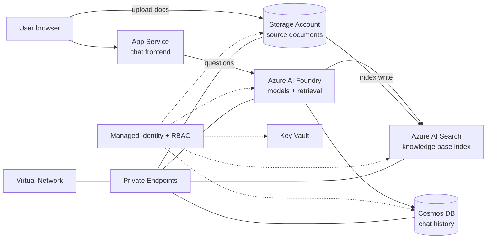

# Chat With Your Data

Ground a conversational assistant in your own documents and get answers with inline citations back to the source.

[**SOLUTION OVERVIEW**](#solution-overview) &nbsp;|&nbsp; [**RESOURCES DEPLOYED**](#resources-deployed) &nbsp;|&nbsp; [**BUSINESS SCENARIO**](#business-scenario) &nbsp;|&nbsp; [**SUPPORTING DOCUMENTATION**](#supporting-documentation)

> [!NOTE]
> This README is mocked/generated placeholder documentation for the `chat-with-data` technical pattern.
> Its content/structure is modeled on: https://github.com/Azure-Samples/chat-with-your-data-solution-accelerator

## Solution overview

Organizations hold vast unstructured knowledge in contracts, policies, product manuals, and benefit guides that is hard to search and slow to answer questions from. Chat With Your Data indexes that content and puts a natural-language chat experience in front of it, so people find grounded answers in seconds instead of digging through files. Users upload documents into a Storage Account; the content is chunked and embedded into an Azure AI Search index. The web chat UI (App Service) sends user questions to Azure OpenAI (via an AI Foundry project), which retrieves relevant chunks from the search index and generates a grounded answer with inline citations. Chat history is persisted in Cosmos DB. A single user-assigned managed identity and Azure RBAC authorize every downstream call -- Key Vault still stores any remaining certificates, and Storage/Cosmos DB/AI Search/AI Foundry sit behind private endpoints with public network access disabled.

### Architecture

### How it works

You ask a question in natural language. The App Service frontend sends it to Azure AI Foundry, which retrieves the most relevant passages from the Azure AI Search index, grounds the language model on that context, and returns the answer with inline citations to the source documents. Ingestion runs separately: documents you upload to the Storage Account are parsed, chunked, embedded, and written to the search index, ready for the next question.

### Additional resources

- [Azure AI Foundry documentation](https://learn.microsoft.com/azure/ai-foundry/)
- [Azure AI Search documentation](https://learn.microsoft.com/azure/search/)
- [Azure App Service documentation](https://learn.microsoft.com/azure/app-service/)

### Key features

Click to learn more about the key features this pattern enables

- Responses are grounded in your indexed content with inline citations back to the source documents.
- Upload files to a document ingestion pipeline that parses, chunks, and embeds them for retrieval.
- Azure AI Search provides the vector/knowledge index; Cosmos DB persists chat history.
- A single user-assigned managed identity and Azure RBAC authorize every downstream call.
- Storage, Cosmos DB, AI Search, and AI Foundry are reachable only through private endpoints, with public network access disabled.
- A single-page chat interface streams answers to the browser and retains chat history across sessions.

## Resources deployed

| Resource | Purpose |
|---|---|
| App Service (chat frontend) | Hosts the web chat UI |
| App Service Plan | Compute plan for the App Service |
| Storage Account | Source documents for the knowledge base |
| Azure AI Search | Vector/knowledge index for RAG retrieval |
| Azure AI Services (Azure OpenAI) | Chat/completions and embeddings |
| AI Foundry Project | Hosts the AI Foundry project/agents |
| Cosmos DB (NoSQL) | Chat history / conversation state |
| Key Vault | Secrets and certificates |
| Managed Identity | Identity for service-to-service auth |
| Log Analytics Workspace | Central log sink |
| Application Insights | App telemetry/tracing |

## Business scenario

Organizations hold large volumes of unstructured content including contracts, policies, and internal documentation that employees must search manually to answer questions or complete work. Chat With Your Data indexes that content and provides a grounded chat interface so employees get accurate, cited answers in seconds.

### Business value

Click to learn more about the value this pattern provides

- Employees get accurate, grounded answers immediately instead of spending time searching through documents manually.
- Inline citations let users verify answers against source material, reducing the risk of acting on incorrect information.
- Deployment into your own Azure subscription keeps your data under your control and within your compliance boundary.

### Use cases

Click to learn more about the use cases this pattern supports

| Use case | Persona | Challenges | Summary |
|---|---|---|---|
| Contract review and summarization | Legal professional, compliance officer | Reading and extracting key terms from large document sets is slow and error-prone. | Index contracts and enable users to query them in natural language, surfacing obligations, deadlines, and clauses with citations. |
| Employee and HR assistance | HR professional, employee | Finding the right policy documents or benefits information across large knowledge bases takes too long. | Index HR policies and employee handbooks, then answer questions with citations to the source document. |
| Customer intelligence | Customer success manager, analyst | Synthesizing account history and customer feedback from unstructured notes is time-consuming. | Ground the assistant on customer-facing documents and notes, making account context instantly accessible. |

## Supporting documentation

### Security guidelines

Every service-to-service call in this pattern is authorized through a managed identity and Azure RBAC
role assignments rather than connection strings or keys. Data services are reachable only through
private endpoints, with public network access disabled.

> This README was generated automatically as placeholder documentation for the `chat-with-data` technical
> pattern.
