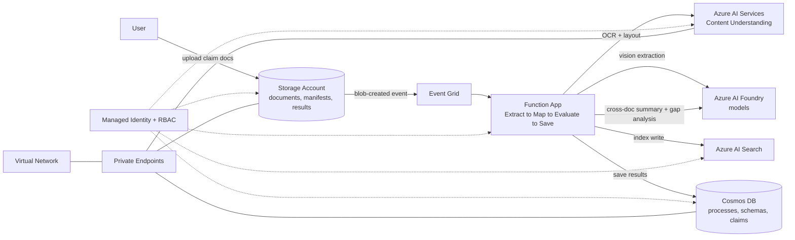

# Content Processing (Document/Claim Processing)

Process multi-document claims by extracting data from each document, applying schemas with confidence scoring, and generating AI-powered summaries and gap analysis across the entire claim.

<div align="center">

[**SOLUTION OVERVIEW**](#solution-overview) &nbsp;|&nbsp; [**RESOURCES DEPLOYED**](#resources-deployed) &nbsp;|&nbsp; [**BUSINESS SCENARIO**](#business-scenario) &nbsp;|&nbsp; [**SUPPORTING DOCUMENTATION**](#supporting-documentation)

</div>

> [!NOTE]
> This README is mocked/generated placeholder documentation for the `document-processing` technical pattern,
> used only so `infra_composer_agent` has a concrete pattern to read and confirm resources from. Its
> content/structure is modeled on: https://github.com/microsoft/content-processing-solution-accelerator

## Solution overview

Documents land in a Storage Account, which raises an Event Grid notification that triggers a Function App. The function calls an Azure AI Services account (Content Understanding-style extraction) to pull structured fields, tables, and images out of each document with confidence scoring, indexes extracted content in Azure AI Search for later lookup, and writes results to Cosmos DB. Once every document in a claim/batch is processed, the function calls Azure OpenAI (via an AI Foundry project) to generate a cross-document summary and perform gap analysis, flagging missing documents and discrepancies. A managed identity with RBAC role assignments is used for every service-to-service call, secrets live in Key Vault, and Storage/Cosmos DB/AI Services sit behind private endpoints with public network access disabled.

### Architecture



### How it works

Upload multiple documents (invoices, forms, images, contracts) to a single claim through the Storage Account. Each document is processed through a 4-stage pipeline in the Function App: Extract (Azure AI Services pulls OCR/layout/entities) -> Map (schema-based transformation) -> Evaluate (confidence scoring) -> Save (Cosmos DB + Storage). Once every document in the claim is processed, a workflow stage calls Azure OpenAI via AI Foundry to produce a consolidated cross-document summary and a gap analysis that flags missing documents or discrepancies across the claim.

### Additional resources

- [Azure AI Content Understanding documentation](https://learn.microsoft.com/azure/ai-services/content-understanding/)
- [Azure AI Foundry documentation](https://learn.microsoft.com/azure/ai-foundry/)
- [Azure Functions documentation](https://learn.microsoft.com/azure/azure-functions/)

### Key features

<details open>
<summary>Click to learn more about the key features this pattern enables</summary>

- Multi-document claim processing -- upload multiple files to a single claim and process them as a batch, with cross-document summarization and gap analysis.
- Multi-modal content processing -- OCR-based text extraction plus vision-model processing for images, tables, and graphs.
- AI-powered summarization and gap analysis after all documents in a claim are processed.
- Schema-based data transformation -- maps extracted content to custom or industry-defined schemas, output as JSON.
- Confidence scoring for extraction accuracy and schema mapping to drive human-in-the-loop review.
- Every service-to-service call is authorized through a managed identity and Azure RBAC.

</details>

## Resources deployed

> This table is read directly by `infra_composer_agent` (see `tech_patterns.get_pattern_resources()`)
> to build its resource plan -- edit it here and the agent will pick up your changes on its next run.
> The `Module` column must match an exact module key from the source module library
> (`infra_new/avm/modules/<category>/<name>.bicep` on the `infra-core-modules-copy` branch).

| Resource | Module | Purpose |
|---|---|---|
| Storage Account | `data/storage-account.bicep` | Inbound document/claim landing zone |
| Event Grid | `data/event-grid.bicep` | Blob-created event trigger |
| Function App | `compute/function-app.bicep` | Extract -> Map -> Evaluate -> Save pipeline |
| Azure AI Services | `ai/ai-services.bicep` | Content Understanding: document/data extraction |
| Azure AI Search | `ai/ai-search.bicep` | Index of extracted content |
| AI Foundry Project | `ai/ai-foundry-project.bicep` | Hosts summarization/gap-analysis models |
| AI Foundry Model Deployment | `ai/ai-foundry-model-deployment.bicep` | Deploys the summarization model |
| Cosmos DB (NoSQL) | `data/cosmos-db-nosql.bicep` | Processes, schemas, and claim results store |
| Key Vault | `security/key-vault.bicep` | Secrets and certificates |
| Managed Identity | `identity/managed-identity.bicep` | Identity for service-to-service auth |
| Role Assignments | `identity/role-assignments.bicep` | Least-privilege RBAC for the identity |
| Log Analytics Workspace | `monitoring/log-analytics.bicep` | Central log sink |
| Application Insights | `monitoring/app-insights.bicep` | Function/app telemetry |
| Virtual Network | `networking/virtual-network.bicep` | Network isolation boundary |
| Private Endpoint | `networking/private-endpoint.bicep` | Private connectivity to data/AI services |
| Private DNS Zone | `networking/private-dns-zone.bicep` | DNS resolution for private endpoints |

## Business scenario

Teams that process multi-document claims -- insurance claims, contract packages, invoice batches, ID verification bundles, or logistics shipment records -- spend significant manual effort extracting data from each document and then cross-checking the set for missing pieces or inconsistencies.

### Business value

<details>
<summary>Click to learn more about the value this pattern provides</summary>

- Consistent, schema-based extraction reduces manual data entry and transcription errors.
- Automated cross-document summarization and gap analysis surfaces missing documents and discrepancies before a human ever opens the claim.
- Confidence scoring focuses reviewer attention only where the model is uncertain.

</details>

### Use cases

<details>
<summary>Click to learn more about the use cases this pattern supports</summary>

| Use case | Persona | Challenges | Summary |
|---|---|---|---|
| Insurance claims processing | Claims adjuster | A claim can include many document types (forms, photos, reports) that must all be cross-checked for completeness and consistency. | Extract structured data from every document in the claim, then summarize and flag gaps automatically. |
| Invoice / contract review | Accounts payable analyst, contract reviewer | Reviewing invoices or contract packages line-by-line for missing fields or terms is slow and error-prone. | Schema-based extraction with confidence scoring highlights fields needing review. |
| Logistics shipment records | Logistics coordinator | Shipment paperwork arrives from multiple sources in inconsistent formats. | Normalize shipment documents into a common schema and flag missing/incomplete records. |

</details>

## Supporting documentation

### How to deploy

This pattern is composed from existing, previously-reviewed AVM Bicep modules using the
[`infra_composer_agent`](../../../tools/infra_composer_agent/) tool rather than being generated from
scratch. To generate a deployable project for this pattern:

```bash
python tools/infra_composer_agent/agent.py \
  --tech-pattern document-processing \
  --prompt "<describe your specific solution name/naming convention and any resources to add or remove>" \
  --target-repo <your-target-repo-url> \
  --validate
```

The agent will first show you the resource table above (re-read live from this file) and ask you to
confirm before pulling any module from the source library or generating anything -- you can still add
or remove resources at that point.

### Security guidelines

Every service-to-service call in this pattern is authorized through a managed identity and Azure RBAC
role assignments (see the `identity/managed-identity.bicep` and `identity/role-assignments.bicep` rows
above) rather than connection strings or keys. Data services are reachable only through private
endpoints, with public network access disabled.

> This README was generated automatically as placeholder documentation for the `document-processing` technical
> pattern. Regenerate it any time with
> `python tools/infra_composer_agent/generate_pattern_readmes.py`.
