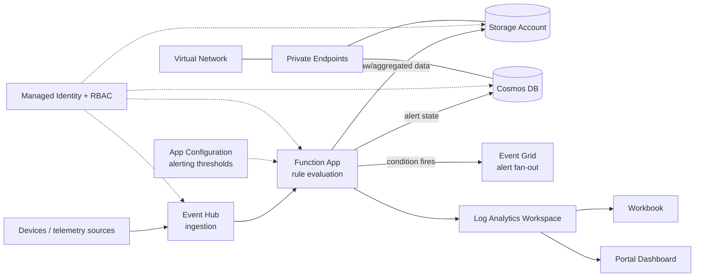

# Real-Time Alerts

A streaming telemetry pipeline that ingests high-volume events, evaluates them for conditions of interest, and raises alerts/dashboards in near real time.

[**SOLUTION OVERVIEW**](#solution-overview) &nbsp;|&nbsp; [**RESOURCES DEPLOYED**](#resources-deployed) &nbsp;|&nbsp; [**BUSINESS SCENARIO**](#business-scenario) &nbsp;|&nbsp; [**SUPPORTING DOCUMENTATION**](#supporting-documentation)

> [!NOTE]
> This README is mocked/generated placeholder documentation for the `realtime-alerts` technical pattern.
> Its content/structure is modeled on: (mocked pattern -- not modeled on a specific public repo, for internal testing only)

## Solution overview

Telemetry/events stream into an Event Hub, which a Function App consumes to evaluate alerting rules and write raw/aggregated results to a Storage Account and Cosmos DB (NoSQL) for alert-state tracking. Configuration for alerting thresholds lives in App Configuration. When a condition fires, an Event Grid topic publishes an alert event for downstream routing. Operational dashboards and workbooks in Log Analytics/Application Insights give on-call teams live visibility, a portal dashboard summarizes system health, and every service-to-service call uses a managed identity with least-privilege RBAC role assignments.

### Architecture

### How it works

High-volume telemetry streams into the Event Hub. The Function App consumes each batch, evaluates it against alerting rules/thresholds stored in App Configuration, and writes both raw and aggregated results to the Storage Account and Cosmos DB (for alert-state tracking). When a rule condition fires, the function publishes an alert event to Event Grid for downstream routing (e.g. notifications, ticketing). Operational workbooks and a portal dashboard built on Log Analytics/Application Insights give on-call teams live visibility into both the pipeline's health and the alerts it has raised.

### Additional resources

- [Azure Event Hubs documentation](https://learn.microsoft.com/azure/event-hubs/)
- [Azure Functions documentation](https://learn.microsoft.com/azure/azure-functions/)
- [Azure Monitor documentation](https://learn.microsoft.com/azure/azure-monitor/)

### Key features

Click to learn more about the key features this pattern enables

- High-throughput telemetry ingestion via Event Hub, decoupled from rule evaluation.
- Alerting thresholds/rules are externalized in App Configuration -- no redeploy needed to tune them.
- Event Grid fan-out lets any number of downstream systems react to a fired alert.
- Operational workbooks and a portal dashboard give on-call teams a single-pane view of system health and active alerts.
- Every service-to-service call is authorized through a managed identity and Azure RBAC.

## Resources deployed

| Resource | Purpose |
|---|---|
| Event Hub | Telemetry ingestion |
| Function App | Stream processing / rule evaluation |
| Storage Account | Raw/aggregated event data |
| Cosmos DB (NoSQL) | Alert state |
| App Configuration | Alerting thresholds |
| Event Grid | Alert fan-out |
| Key Vault | Secrets and certificates |
| Managed Identity | Identity for service-to-service auth |
| Log Analytics Workspace | Central log sink |
| Application Insights | Function/app telemetry |
| Data Collection Rule | Routes telemetry into Log Analytics |
| Workbook | Operational dashboards |
| Portal Dashboard | System-health summary |

## Business scenario

Teams operating high-volume streaming/IoT workloads need to detect conditions of interest (thresholds, anomalies, SLA breaches) as they happen, not hours later in a batch report, and need on-call staff to see both the raw telemetry and the alerts it produced in one place.

### Business value

Click to learn more about the value this pattern provides

- Near real-time detection reduces the time between an incident occurring and a team being notified.
- Externalized alerting thresholds let operations teams tune sensitivity without a code deployment.
- A unified operational dashboard reduces the number of tools on-call staff must check during an incident.

### Use cases

Click to learn more about the use cases this pattern supports

| Use case | Persona | Challenges | Summary |
|---|---|---|---|
| IoT device health monitoring | Operations/on-call engineer | Thousands of devices report telemetry continuously; manual review can't keep up with the volume. | Stream device telemetry through Event Hub, evaluate health rules in near real time, and alert on-call staff the moment a device degrades. |
| SLA / threshold breach alerting | Site reliability engineer | Detecting an SLA breach after the fact is too late to prevent customer impact. | Evaluate streaming metrics against configurable thresholds and fire alerts the moment a breach condition is met. |
| Anomaly detection on transaction streams | Fraud/risk analyst | Reviewing transaction logs in batch misses time-sensitive fraud patterns. | Stream transactions through the pipeline and raise near-real-time alerts on anomalous patterns for investigation. |

## Supporting documentation

### Security guidelines

Every service-to-service call in this pattern is authorized through a managed identity and Azure RBAC
role assignments rather than connection strings or keys. Data services are reachable only through
private endpoints, with public network access disabled.

> This README was generated automatically as placeholder documentation for the `realtime-alerts` technical
> pattern.
