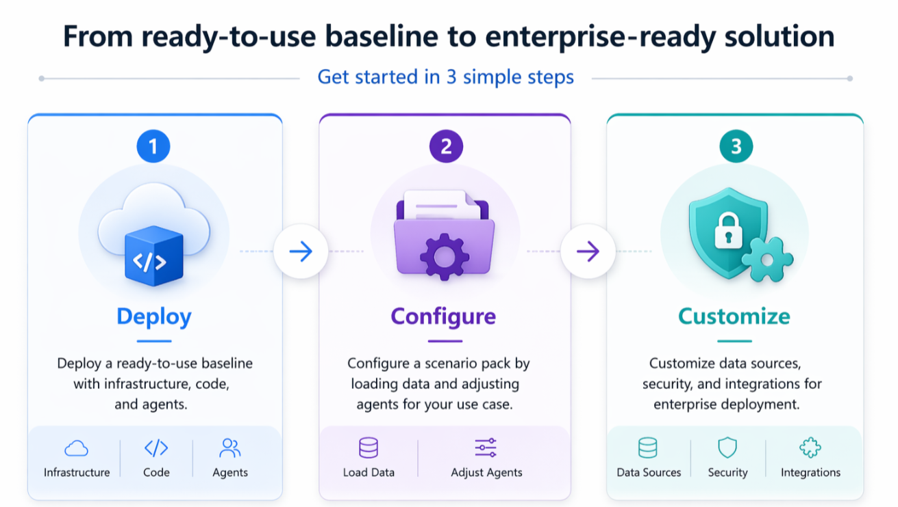
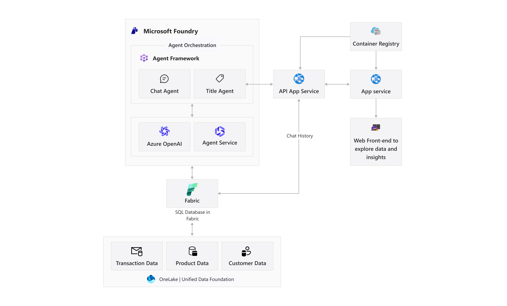
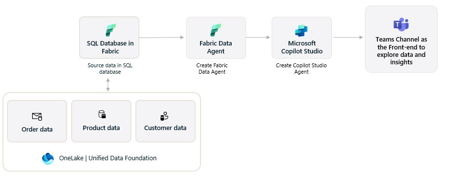

# Agentic Applications for Unified Data Foundation

Build and scale agentic AI workflows on Fabric—grounded in governed enterprise data and configured with scenario packs for each customer conversation.

 [Solution Architecture](#solution-architecture) · [Configure for Your Scenario](#scenario-packs) · [Get Started](#get-started) · [Video Overview](#video-overview) 

<a id="businessoverview"></a>
This solution accelerator empowers organizations to make faster, smarter decisions at scale by leveraging agentic AI solutions built on a unified data foundation with Microsoft Fabric. With seamless integration of Microsoft Foundry agents and Agent Framework orchestration, teams can design intelligent workflows that automate routine processes, streamline operations, and enable natural language querying across enterprise datasets. This ensures that governed, high-quality data is accessible not only to technical specialists but also to business users, creating a shared environment where insights are surfaced more easily and decisions are grounded in trusted information.

By unifying data access and applying AI in the flow of work, organizations gain the agility to respond rapidly to changing business needs, foster collaboration across teams, and drive innovation with greater confidence.

> **Note:** With any AI solutions you create using these templates, you are responsible for assessing all associated risks and for complying with all applicable laws and safety standards. Learn more in the transparency documents for [Agent Service](https://learn.microsoft.com/en-us/azure/ai-foundry/responsible-ai/agents/transparency-note) and [Agent Framework](https://github.com/microsoft/agent-framework/blob/main/TRANSPARENCY_FAQ.md).

<br>



<br>


> 💡 **Tip:** Open this repo in VS Code with Copilot and ask "Help me deploy this accelerator" for guided, step-by-step assistance.


---
<a id="solution-architecture"></a>

##  Solution Architecture
Leverages the Unified Data Foundation in Fabric accelerator, SQL Database in Fabric, Agent Framework, and Microsoft Foundry to query structured data. Structured data sets are analyzed through intelligent and orchestrated responses powered by an interactive web front-end for exploring semantic models and data assets. Insights are generated using natural language.

Microsoft Fabric and Microsoft Foundry:



[→ Technical Architecture Documentation](./documents/TechnicalArchitecture.md)

<details>
<summary>View Microsoft Fabric and Microsoft Copilot Studio solution architecture</summary>



</details>


<a id="scenario-packs"></a>

## Configure for Your Scenario

Pre-built scenario packs help you accelerate implementation with reusable data mappings, agent instructions, and UI patterns. Use the examples below to identify a starting point for your business scenario.

| Industry | Use Case | Workflow | Business Value |
|----------|----------|----------|----------------|
| **Retail & Consumer Goods** | Sales analysis & product performance | Explore unified customer, product, and sales insights through natural language queries (e.g., "what are my top-performing products?" or "Which segments show the highest YoY growth?") |  Faster time to insights, reduced dependency on complex dashboards, and improved decision-making through accessible, unified data |
| **Financial Services** | Client meeting preparation | Surface customer information in the flow of work, personalize interactions and uncover actionable insights like "how many policies does this customer have?" or "has this customer ever been deliquent?" | Reduce churn and improve customer satisfaction by surfacing risk signals, enabling proactive engagement, and delivering more personalized customer experiences |


---

⚠️ The sample data associated with each scenario in this repository is synthetic and generated. The data is intended for use as sample data only. 
<br>
<br>

<a id="get-started"></a>

##  Get Started

Deploy the full solution in minutes with Azure Developer CLI:

```bash
# Clone repository
git clone https://github.com/microsoft/agentic-applications-for-unified-data-foundation-solution-accelerator.git
cd agentic-applications-for-unified-data-foundation-solution-accelerator

# Login and authtentication
azd auth login # or: azd auth login --tenant-id <tenant-id>

# Variable configuration
azd config set provision.preflight off

# Provision and deploy
azd up
```

> ⚠️ **Before you deploy:** Check [Prerequisites & Costs](./documents/PrerequisitesCosts.md) and [Azure OpenAI quota](./documents/QuotaCheck.md).

| [](https://codespaces.new/microsoft/agentic-applications-for-unified-data-foundation-solution-accelerator) | [](https://vscode.dev/redirect?url=vscode://ms-vscode-remote.remote-containers/cloneInVolume?url=https://github.com/microsoft/agentic-applications-for-unified-data-foundation-solution-accelerator) | [&message=Open&color=blue&logo=visualstudiocode&logoColor=white)](https://vscode.dev/azure/?vscode-azure-exp=foundry&agentPayload=eyJiYXNlVXJsIjogImh0dHBzOi8vcmF3LmdpdGh1YnVzZXJjb250ZW50LmNvbS9taWNyb3NvZnQvYWdlbnRpYy1hcHBsaWNhdGlvbnMtZm9yLXVuaWZpZWQtZGF0YS1mb3VuZGF0aW9uLXNvbHV0aW9uLWFjY2VsZXJhdG9yL3JlZnMvaGVhZHMvbWFpbi9pbmZyYS92c2NvZGVfd2ViIiwgImluZGV4VXJsIjogIi9pbmRleC5qc29uIiwgInZhcmlhYmxlcyI6IHsiYWdlbnRJZCI6ICIiLCAiY29ubmVjdGlvblN0cmluZyI6ICIiLCAidGhyZWFkSWQiOiAiIiwgInVzZXJNZXNzYWdlIjogIiIsICJwbGF5Z3JvdW5kTmFtZSI6ICIiLCAibG9jYXRpb24iOiAiIiwgInN1YnNjcmlwdGlvbklkIjogIiIsICJyZXNvdXJjZUlkIjogIiIsICJwcm9qZWN0UmVzb3VyY2VJZCI6ICIiLCAiZW5kcG9pbnQiOiAiIn0sICJjb2RlUm91dGUiOiBbImFpLXByb2plY3RzLXNkayIsICJweXRob24iLCAiZGVmYXVsdC1henVyZS1hdXRoIiwgImVuZHBvaW50Il19) |
|---|---|---|

[→ Full Deployment Guide](./documents/DeploymentGuide.md)


---

<a id="choose-your-path"></a>

### Choose the Path That Fits Your Needs

| Deploy | Configure | Customize |
|--------|-----------|-----------|
| Start with a working baseline using infrastructure, code, and agents. | Adapt the solution with a scenario pack, loaded data, and agent changes. | Extend the solution with enterprise data sources, security, networking, and integrations. |
| [Deployment Guide →](./documents/DeploymentGuide.md) | [Configuration Guide →](./documents/DeploymentGuide.md) | [Customization Guide →](./documents/DeploymentGuide.md) |


**Additional setup options:**
- [Local Development Setup](./documents/LocalDevelopmentSetup.md) — Windows, Linux, and WSL2 configuration

---

<a id="video-overview"></a>

### Video Overview

> 🎬 **Coming Soon:** Video walkthrough of deployment, configuration, and customization steps.

---

##  Supporting Documentation

| Documentation | Description |
|---|---|
| [Technical Architecture](./documents/TechnicalArchitecture.md) | System design, components, and solution flow |
| [Scenario Packs](#scenario-packs) | Example business scenarios and configuration options |
| [Security Guidelines](./documents/SecurityGuidelines.md) | Identity, networking, and security practices |
| [Prerequisites & Costs](./documents/PrerequisitesCosts.md) | Access requirements, regional availability, and cost considerations |
| [Deployment Guide](./documents/DeploymentGuide.md) | Step-by-step deployment instructions |
| [Demonstrator Guide](./documents/DeploymentGuide.md) | Details on how to use and showcase the solution accelerator |
| [Workshop Guide](https://microsoft.github.io/agentic-applications-for-unified-data-foundation-solution-accelerator/quick-deploy/deployment-guide-optionA/) | Hands-on walkthrough for building AI agents |
| [Troubleshooting](./documents/TroubleShootingSteps.md) | Common issues and solutions |

---

## Related Resources

| Resource | Description |
|---|---|
| [Unified Data Foundation with Fabric](https://github.com/microsoft/unified-data-foundation-with-fabric-solution-accelerator) | Provides a unified data foundation with integrated data architecture leveraging Microsoft Fabric, Microsoft Purview, and Azure Databricks to deliver a unified, integrated, and governed analytics platform. |
| [AI Playbook](https://learn.microsoft.com/en-us/ai/playbook/) | The Artificial Intelligence (AI) Playbook provides enterprise software engineers with solutions, capabilities, and code developed to solve real-world AI problems. |
| [Data Playbook](https://learn.microsoft.com/en-us/data-engineering/playbook/understanding-data-playbook) | The data playbook provides enterprise software engineers with solutions which contain code developed to solve real-world problems. Everything in the playbook is developed with, and validated by, some of Microsoft's largest and most influential customers and partners. |

---

<a id="feedback"></a>

## Feedback & Contributing

- [Submit an Issue](https://github.com/microsoft/agentic-applications-for-unified-data-foundation-solution-accelerator/issues)

---

## Responsible AI

See [Transparency FAQ](./TRANSPARENCY_FAQ.md) for responsible AI transparency details.

---

## Disclaimers

To the extent that the Software includes components or code used in or derived from Microsoft products or services, including without limitation Microsoft Azure Services (collectively, "Microsoft Products and Services"), you must also comply with the Product Terms applicable to such Microsoft Products and Services. You acknowledge and agree that the license governing the Software does not grant you a license or other right to use Microsoft Products and Services. Nothing in the license or this ReadMe file will serve to supersede, amend, terminate or modify any terms in the Product Terms for any Microsoft Products and Services.

You must also comply with all domestic and international export laws and regulations that apply to the Software, which include restrictions on destinations, end users, and end use. For further information on export restrictions, visit https://aka.ms/exporting.

You acknowledge that the Software and Microsoft Products and Services (1) are not designed, intended or made available as a medical device(s), and (2) are not designed or intended to be a substitute for professional medical advice, diagnosis, treatment, or judgment and should not be used to replace or as a substitute for professional medical advice, diagnosis, treatment, or judgment. Customer is solely responsible for displaying and/or obtaining appropriate consents, warnings, disclaimers, and acknowledgements to end users of Customer's implementation of the Online Services.

You acknowledge the Software is not subject to SOC 1 and SOC 2 compliance audits. No Microsoft technology, nor any of its component technologies, including the Software, is intended or made available as a substitute for the professional advice, opinion, or judgement of a certified financial services professional. Do not use the Software to replace, substitute, or provide professional financial advice or judgment.

BY ACCESSING OR USING THE SOFTWARE, YOU ACKNOWLEDGE THAT THE SOFTWARE IS NOT DESIGNED OR INTENDED TO SUPPORT ANY USE IN WHICH A SERVICE INTERRUPTION, DEFECT, ERROR, OR OTHER FAILURE OF THE SOFTWARE COULD RESULT IN THE DEATH OR SERIOUS BODILY INJURY OF ANY PERSON OR IN PHYSICAL OR ENVIRONMENTAL DAMAGE (COLLECTIVELY, "HIGH-RISK USE"), AND THAT YOU WILL ENSURE THAT, IN THE EVENT OF ANY INTERRUPTION, DEFECT, ERROR, OR OTHER FAILURE OF THE SOFTWARE, THE SAFETY OF PEOPLE, PROPERTY, AND THE ENVIRONMENT ARE NOT REDUCED BELOW A LEVEL THAT IS REASONABLY, APPROPRIATE, AND LEGAL, WHETHER IN GENERAL OR IN A SPECIFIC INDUSTRY. BY ACCESSING THE SOFTWARE, YOU FURTHER ACKNOWLEDGE THAT YOUR HIGH-RISK USE OF THE SOFTWARE IS AT YOUR OWN RISK.

This accelerator is a template and should be adapted to your own environment before production use.

---

## License

This project is licensed under the MIT License - see the [LICENSE](./LICENSE) file for details.
