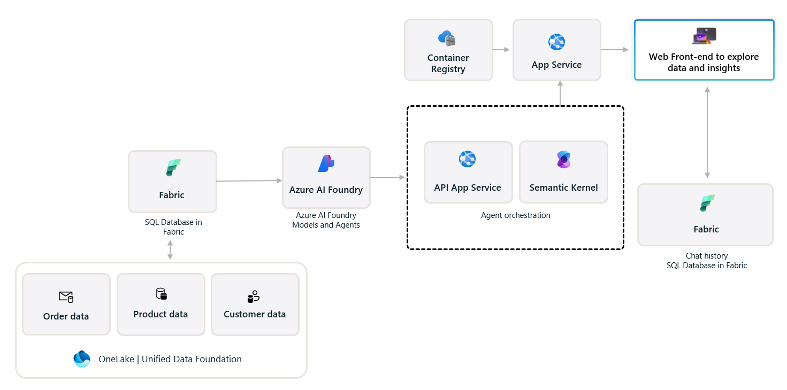
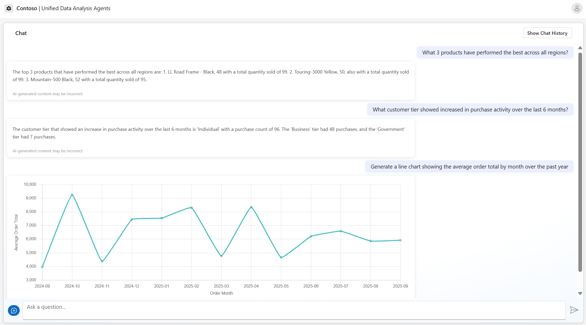

# Agentic Applications for Unified Data Foundation
Note: This repository is in private preview. Certain features might not be supported or might have constrained capabilities. For more information, see [Supplemental Terms of Use for Microsoft Azure Previews](https://azure.microsoft.com/en-us/support/legal/preview-supplemental-terms).

 
This solution accelerator empowers organizations to make faster, smarter decisions at scale by leveraging agentic AI solutions built on a unified data foundation with Microsoft Fabric. With seamless integration of Azure AI Foundry agents and Semantic Kernel orchestration, teams can design intelligent workflows that automate routine processes, streamline operations, and enable natural language querying across enterprise datasets. This ensures that governed, high-quality data is accessible not only to technical specialists but also to business users, creating a shared environment where insights are surfaced more easily and decisions are grounded in trusted information. By unifying data access and applying AI in the flow of work, organizations gain the agility to respond rapidly to changing business needs, foster collaboration across teams, and drive innovation with greater confidence.

 

  
[**SOLUTION OVERVIEW**](#solution-overview)  \| [**QUICK DEPLOY**](#quick-deploy)  \| [**BUSINESS SCENARIO**](#business-scenario)  \| [**SUPPORTING DOCUMENTATION**](#supporting-documentation)

 

<h2>
Solution overview
</h2>

Leverages the Unified Data Foundation in Fabric accelerator, SQL Database in Fabric, Semantic Kernel, and AI Foundry to query structured data. Structured data sets are analyzed through intelligent and orchestrated responses powered by an interactive web front-end for exploring semantic models and data assets. Insights are generated using natural language.

### Solution architecture
||
|---|

### Additional resources

[Technical Architecture](./documents/TechnicalArchitecture.md)

 
<h2>
Features
</h2>

### Key features

  

Click to learn more about the key features this solution enables
  

**Built on Microsoft Fabric + Azure AI Foundry**
- **Unified data foundation with Fabric**    
Leverage the foundational capabilities of Microsoft Fabric and a Unified Data Foundation to build intelligent agents that stand apart in orchestration, retrieval, and user experience

- **Governed data at scale**    
Seamlessly integrate with Fabric’s data foundation to ensure performance, scalability, and extensibility.

- **Natural language interaction**    
Azure AI Foundry Agents coordinate orchestration and retrieval to deliver fast, contextual answers realizing insights faster. Enable intuitive, natural language querying capabilities that unify access across enterprise data assets.

  
<h2>
Quick deploy
</h2>

### How to install or deploy
Follow the quick deploy steps on the deployment guide to deploy this solution to your own Azure subscription.

[Click here to launch the deployment guide](./documents/DeploymentGuide.md)
  

|  |  | [&message=Open&color=blue&logo=visualstudiocode&logoColor=white)](https://insiders.vscode.dev/azure/?vscode-azure-exp=foundry&agentPayload=eyJiYXNlVXJsIjogImh0dHBzOi8vcmF3LmdpdGh1YnVzZXJjb250ZW50LmNvbS9taWNyb3NvZnQvYWdlbnRpYy1hcHBsaWNhdGlvbnMtZm9yLXVuaWZpZWQtZGF0YS1mb3VuZGF0aW9uLXNvbHV0aW9uLWFjY2VsZXJhdG9yL3JlZnMvaGVhZHMvbWFpbi9pbmZyYS92c2NvZGVfd2ViIiwgImluZGV4VXJsIjogIi9pbmRleC5qc29uIiwgInZhcmlhYmxlcyI6IHsiYWdlbnRJZCI6ICIiLCAiY29ubmVjdGlvblN0cmluZyI6ICIiLCAidGhyZWFkSWQiOiAiIiwgInVzZXJNZXNzYWdlIjogIiIsICJwbGF5Z3JvdW5kTmFtZSI6ICIiLCAibG9jYXRpb24iOiAiIiwgInN1YnNjcmlwdGlvbklkIjogIiIsICJyZXNvdXJjZUlkIjogIiIsICJwcm9qZWN0UmVzb3VyY2VJZCI6ICIiLCAiZW5kcG9pbnQiOiAiIn0sICJjb2RlUm91dGUiOiBbImFpLXByb2plY3RzLXNkayIsICJweXRob24iLCAiZGVmYXVsdC1henVyZS1hdXRoIiwgImVuZHBvaW50Il19) |
|---|---|---|

 

> ⚠️ **Important: Check Azure OpenAI Quota Availability**
  To ensure sufficient quota is available in your subscription, please follow [quota check instructions guide](./documents/QuotaCheck.md) before you deploy the solution.

 

### Prerequisites and costs
To deploy this solution accelerator, ensure you have access to an [Azure subscription](https://azure.microsoft.com/free/) with the necessary permissions to create **resource groups, resources, app registrations, and assign roles at the resource group level**. This should include Contributor role at the subscription level and  Role Based Access Control role on the subscription and/or resource group level. Follow the steps in [Azure Account Set Up](./documents/AzureAccountSetUp.md). You will also need to have a minimum of an F2 Fabric capacity. Follow the steps in [Fabric Capacity Set Up](https://learn.microsoft.com/en-us/fabric/admin/capacity-settings?tabs=fabric-capacity#create-a-new-capacity).

Here are some example regions where the services are available: East US, East US2, Australia East, UK South, France Central.

Check the [Azure Products by Region](https://azure.microsoft.com/en-us/explore/global-infrastructure/products-by-region/?products=all&regions=all) page and select a **region** where the following services are available.

Pricing varies by region and usage, so it isn't possible to predict exact costs for your usage. The majority of Azure resources used in this infrastructure are on usage-based pricing tiers. However, some services—such as Azure Container Registry, which has a fixed cost per registry per day, and others like Cosmos DB or SQL Database when provisioned—may incur baseline charges regardless of actual usage.

Use the [Azure pricing calculator](https://azure.microsoft.com/en-us/pricing/calculator) and the [Fabric Capacity Estimator](https://www.microsoft.com/en-us/microsoft-fabric/capacity-estimator) to calculate the cost of this solution in your subscription. 

Review a [sample pricing sheet](https://azure.com/e/708895d4fc4449b1826016fad8a83fe0) in the event you want to customize and scale usage.

_Note: This is not meant to outline all costs as selected SKUs, scaled use, customizations, and integrations into your own tenant can affect the total consumption of this sample solution. The sample pricing sheet is meant to give you a starting point to customize the estimate for your specific needs._

 

| Product | Description | Tier / Expected Usage Notes | Cost |
|---|---|---|---|
| [Azure AI Foundry](https://learn.microsoft.com/en-us/azure/ai-foundry) | Used to orchestrate and build AI workflows that combine Azure AI services. | Free Tier | [Pricing](https://azure.microsoft.com/pricing/details/ai-studio/) |
| [Azure AI Services (OpenAI)](https://learn.microsoft.com/en-us/azure/cognitive-services/openai/overview) | Enables language understanding and chat capabilities using GPT models. | S0 Tier; pricing depends on token volume and model used (e.g., GPT-4o-mini). | [Pricing](https://azure.microsoft.com/pricing/details/cognitive-services/) |
| [Azure Container Apps](https://learn.microsoft.com/en-us/azure/container-apps/overview) | Hosts microservices and APIs powering the front-end and backend orchestration. | Consumption plan with 0.5 vCPU, 1GiB memory; includes a free usage tier. | [Pricing](https://azure.microsoft.com/pricing/details/container-apps/) |
| [Azure Container Registry](https://learn.microsoft.com/en-us/azure/container-registry/container-registry-intro) | Stores and serves container images used by Azure Container Apps. | Basic Tier; fixed daily cost per registry. | [Pricing](https://azure.microsoft.com/pricing/details/container-registry/) |
| [Azure Monitor / Log Analytics](https://learn.microsoft.com/en-us/azure/azure-monitor/logs/log-analytics-overview) | Collects and analyzes telemetry and logs from services and containers. | Pay-as-you-go; charges based on data ingestion volume. | [Pricing](https://azure.microsoft.com/pricing/details/monitor/) |
| [SQL Database in Fabric](https://learn.microsoft.com/en-us/fabric/fundamentals/microsoft-fabric-overview) | Stores structured data including insights, metadata, and chat history. | F2 capacity; fixed monthly cost per capacity. | [Pricing](https://azure.microsoft.com/en-us/pricing/details/microsoft-fabric/) |
| 

 

>⚠️ **Important:** To avoid unnecessary costs, remember to take down your app if it's no longer in use,
either by deleting the resource group in the Portal or running `azd down`.

  
<h2>
Business scenario
</h2>

||
|---|

 

The sample data illustrates how this accelerator could be used for an sales analyst scenario across industries. 
In this scenario, an organization is in the process of analyzing top performing products for sales research. Previously, the sales analyst had to sift through disparate sales and customer data across data silos. Leveraging the solution accelerator, the analyst now has access to unified data in Microsoft Fabric enabling a holistic view of customer and sales performance data. This functionality allows for the analyst to interrogate the data (e.g. "which customer segments show strongest year-over-year revenue growth", "what are my top performance products by demographic").

⚠️ The sample data used in this repository is synthetic and generated. The data is intended for use as sample data only.

### Business value

  
Click to learn more about what value this solution provides

 

  - **Intelligent data interaction** 
Enable conversational agents that understand your company’s unique data and transform natural language questions into automated queries for data-driven answers. Train agents with instructions to gain visibility.

- **Accelerated insights & productivity**
Access rapid insights with intelligent data prep, seamless integration, and AI-guided exploration. Analyze, and enrich data to uncover trends, automate workflows, and turn ideas into scalable, agentic solutions.

- **Governed, scalable and trusted data**
Deliver actionable insights through robust governance and metadata. Improve decision-making, operational efficiency, and reduce costs with secure, self-service access to high-quality data in a unified platform. 

     

  

<h2>
Supporting documentation
</h2>

### Security guidelines

This solution uses [Managed Identity](https://learn.microsoft.com/en-us/entra/identity/managed-identities-azure-resources/overview) for secure access to Azure resources during local development and production deployment, eliminating the need for hard-coded credentials.

To maintain strong security practices, it is recommended that GitHub repositories built on this solution enable [GitHub secret scanning](https://docs.github.com/code-security/secret-scanning/about-secret-scanning) to detect accidental secret exposure.

Additional security considerations include:

- Enabling [Microsoft Defender for Cloud](https://learn.microsoft.com/en-us/azure/defender-for-cloud) to monitor and secure Azure resources.
- Using [Virtual Networks](https://learn.microsoft.com/en-us/azure/container-apps/networking?tabs=workload-profiles-env%2Cazure-cli) or [firewall rules](https://learn.microsoft.com/en-us/azure/container-apps/waf-app-gateway) to protect Azure Container Apps from unauthorized access.

 

### Cross references
Check out similar solution accelerators

| Solution Accelerator | Description |
|---|---|
| [Unified&nbsp;data&nbsp;foundation&nbsp;with&nbsp;Fabric](https://github.com/microsoft/unified-data-foundation-with-fabric-solution-accelerator) | Provides a unified data foundation with integrated data architecture leveraging Microsoft Fabric, Microsoft Purview, and Azure Databricks to deliver a unified, integrated, and governed analytics platform. |

 

## Provide feedback

Have questions, find a bug, or want to request a feature? [Submit a new issue](https://github.com/microsoft/agentic-applications-for-unified-data-foundation-solution-accelerator/issues) on this repo and we'll connect.

 

## Responsible AI Transparency FAQ 
Please refer to [Transparency FAQ](./TRANSPARENCY_FAQ.md) for responsible AI transparency details of this solution accelerator.

 

## Disclaimers

To the extent that the Software includes components or code used in or derived from Microsoft products or services, including without limitation Microsoft Azure Services (collectively, “Microsoft Products and Services”), you must also comply with the Product Terms applicable to such Microsoft Products and Services. You acknowledge and agree that the license governing the Software does not grant you a license or other right to use Microsoft Products and Services. Nothing in the license or this ReadMe file will serve to supersede, amend, terminate or modify any terms in the Product Terms for any Microsoft Products and Services. 

You must also comply with all domestic and international export laws and regulations that apply to the Software, which include restrictions on destinations, end users, and end use. For further information on export restrictions, visit https://aka.ms/exporting. 

You acknowledge that the Software and Microsoft Products and Services (1) are not designed, intended or made available as a medical device(s), and (2) are not designed or intended to be a substitute for professional medical advice, diagnosis, treatment, or judgment and should not be used to replace or as a substitute for professional medical advice, diagnosis, treatment, or judgment. Customer is solely responsible for displaying and/or obtaining appropriate consents, warnings, disclaimers, and acknowledgements to end users of Customer’s implementation of the Online Services. 

You acknowledge the Software is not subject to SOC 1 and SOC 2 compliance audits. No Microsoft technology, nor any of its component technologies, including the Software, is intended or made available as a substitute for the professional advice, opinion, or judgement of a certified financial services professional. Do not use the Software to replace, substitute, or provide professional financial advice or judgment.  

BY ACCESSING OR USING THE SOFTWARE, YOU ACKNOWLEDGE THAT THE SOFTWARE IS NOT DESIGNED OR INTENDED TO SUPPORT ANY USE IN WHICH A SERVICE INTERRUPTION, DEFECT, ERROR, OR OTHER FAILURE OF THE SOFTWARE COULD RESULT IN THE DEATH OR SERIOUS BODILY INJURY OF ANY PERSON OR IN PHYSICAL OR ENVIRONMENTAL DAMAGE (COLLECTIVELY, “HIGH-RISK USE”), AND THAT YOU WILL ENSURE THAT, IN THE EVENT OF ANY INTERRUPTION, DEFECT, ERROR, OR OTHER FAILURE OF THE SOFTWARE, THE SAFETY OF PEOPLE, PROPERTY, AND THE ENVIRONMENT ARE NOT REDUCED BELOW A LEVEL THAT IS REASONABLY, APPROPRIATE, AND LEGAL, WHETHER IN GENERAL OR IN A SPECIFIC INDUSTRY. BY ACCESSING THE SOFTWARE, YOU FURTHER ACKNOWLEDGE THAT YOUR HIGH-RISK USE OF THE SOFTWARE IS AT YOUR OWN RISK.
