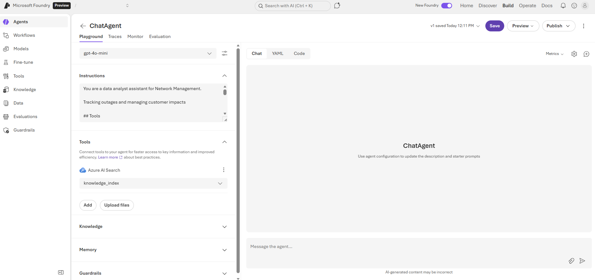
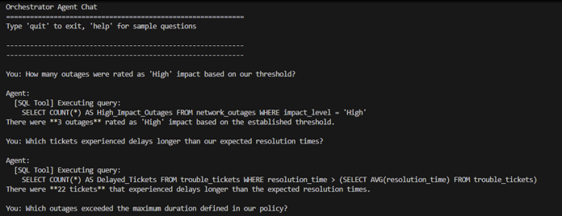

# Workshop Outcome

Once you have completed this workshop, you should have the following outcomes:

## 1. Fabric Data Agent

After completing the workshop, you will have a working Fabric data agent that can answer natural language questions using your own data. When you interact with the agent, you will be able to:
- Ask questions in plain English
- Receive relevant, contextual responses generated by the agent
- View the underlying GQL (Graph Query Language) queries that the agent uses to retrieve data
This demonstrates how AI can bridge the gap between business questions and technical data sources, making your data more accessible and actionable.

<!--  -->

## 2. Foundry Agent in Foundry Portal

You will see the Foundry agent in the Microsoft Foundry portal, where Foundry IQ is used to enable the agent to access and reason over unstructured data. The Microsoft Foundry portal allows you to see the agents, view the models and tools that help the agent answer questions using your data.

## 3. Foundry Agent Script Output

You will be able to run scripts that interact with the Foundry agents and observe the output directly. This will show you how to automate interactions with the agents, integrate it into workflows, and analyze the results programmatically. You will see the agent's responses and data processing in a script-driven context.

## 4. Chat Application

You will have access to a chat application that provides a user-friendly interface for interacting with your agents. After the workshop, you will be able to hold conversations with the agent, ask questions, and receive answers in real time. The chat application demonstrates how conversational AI can be embedded into business solutions for enhanced productivity and engagement.

<!--  -->

---

[← Workshop Flow](workshop-flow.md) | [Deploy solution →](../01-deploy/index.md)

