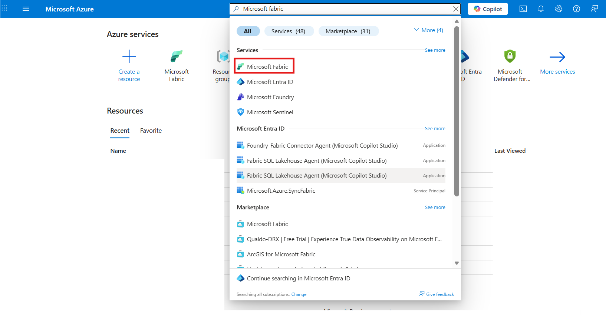
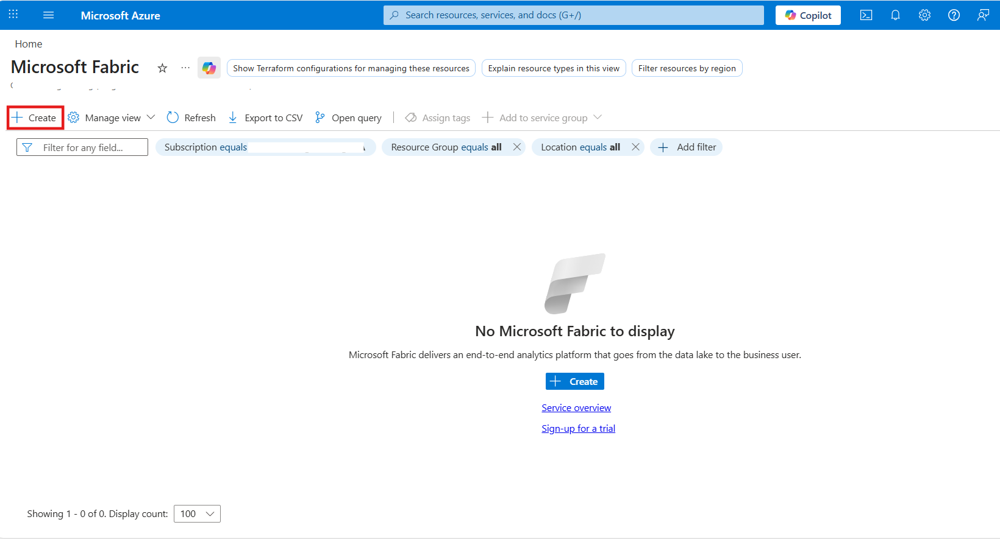
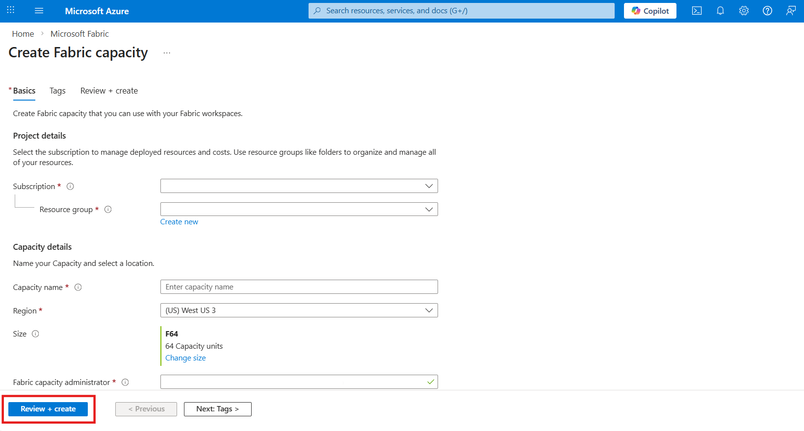
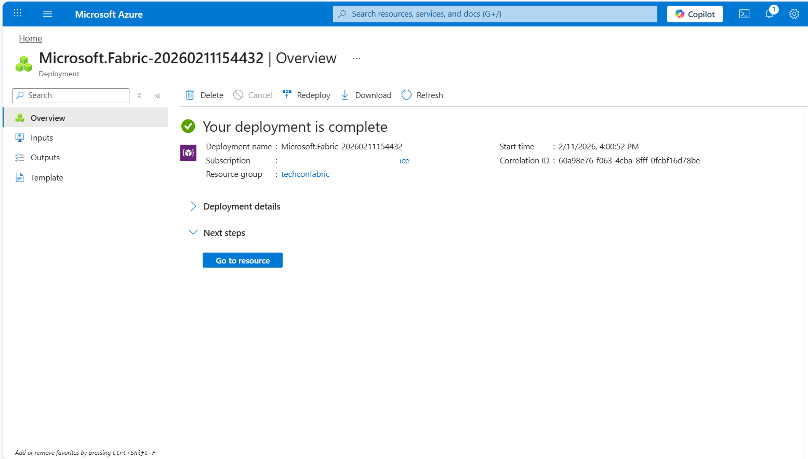
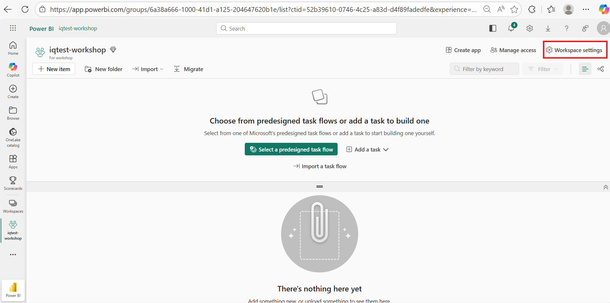

# Create Fabric workspace

Create and configure your Microsoft Fabric workspace for Fabric IQ.

!!! note "Using Azure-Only Mode?"
    If you set `AZURE_ENV_ONLY=true` before running `azd up`, you can **skip this page** and proceed directly to [Configure dev environment](03-configure.md).

## Prerequisites

- An active Azure subscription with permissions to create resources
- Workspace admin permissions
- [Fabric IQ enabled on your tenant](https://learn.microsoft.com/en-us/fabric/iq/ontology/overview-tenant-settings)

---

## Step 1 — Create a Fabric capacity in Azure

If you already have a Fabric capacity, skip to [Step 2](#step-2-create-a-fabric-workspace).

1. Sign in to the [Azure Portal](https://portal.azure.com/).

2. Search for **Microsoft Fabric** in the top search bar and select **Microsoft Fabric** from the results.

    

3. Click **+ Create** to start creating a new Fabric capacity.

    

4. Fill in the required details on the **Basics** tab:

    | Field | Value |
    |-------|-------|
    | **Subscription** | Select your Azure subscription |
    | **Resource group** | Select an existing resource group or create a new one |
    | **Capacity name** | Enter a unique name (e.g., `fabriccap-workshop`) |
    | **Region** | Select a region close to your other Azure resources |
    | **Size** | Click Change Size & Select **F8** or higher (F8 is recommended for this workshop) |
    | **Fabric capacity administrator** | This should be the user account that will manage the workspace. |


    

5. Click **Review + create**, verify the settings, and then click **Create**.

    

7. Wait for the deployment to complete. This typically takes 1–2 minutes.

    

---

## Step 2 — Create a Fabric workspace
1. Navigate to [Microsoft Fabric](https://app.fabric.microsoft.com/) and sign in with your Azure account.

3. Click **Workspaces** in the left navigation panel.

    

4. Click **+ New workspace**.

    

5. Fill in the workspace details:

    | Field | Value |
    |-------|-------|
    | **Name** | Enter a name (e.g., `iq-workshop`) |
    | **Description** | *(Optional)* A short description of the workspace |

    

6. Expand the **Advanced** section and configure the license:

    - Under **License mode**, select **Fabric capacity**.
    - Under **Capacity**, select the Fabric capacity you created in [Step 1](#step-1-create-a-fabric-capacity-in-azure) (or an existing one if you have it already).

    

7. Click **Apply** to create the workspace.

    

---

## Step 3 — Verify workspace settings

1. Open your newly created workspace or an existing workspace.

2. Click the **Workspace settings** gear icon (⚙️) in the top-right area.

    

3. Go to **License info** and verify:

    - [x] The workspace is assigned to a **Fabric capacity**
    - [x] The capacity SKU is **F8** or higher

    

---

## Step 4 — Retrieve the workspace ID

You will need the workspace ID to configure the solution in the next step.

1. Open your workspace in the browser.

2. Look at the URL — the workspace ID is the GUID that appears after `/groups/`:

    ```
    https://app.fabric.microsoft.com/groups/{workspace-id}/...
    ```

    

3. Copy the workspace ID and save it for later. You'll use it in the [Configure dev environment](03-configure.md) step.

!!! tip "Finding the workspace ID"
    For more details, refer to the Microsoft documentation: [Identify your workspace ID](https://learn.microsoft.com/en-us/fabric/admin/portal-workspace#identify-your-workspace-id).

---

## Summary

You should now have:

| Item |
|------|
| Fabric capacity created in Azure (F8+) |
| Fabric workspace created and linked to capacity |
| Workspace ID copied for configuration |

!!! success "Ready to Continue"
    You have your Fabric workspace ready. Proceed to configure your dev environment.

---

[← Deploy Azure resources](01-deploy-azure.md) | [Configure dev environment →](03-configure.md)
