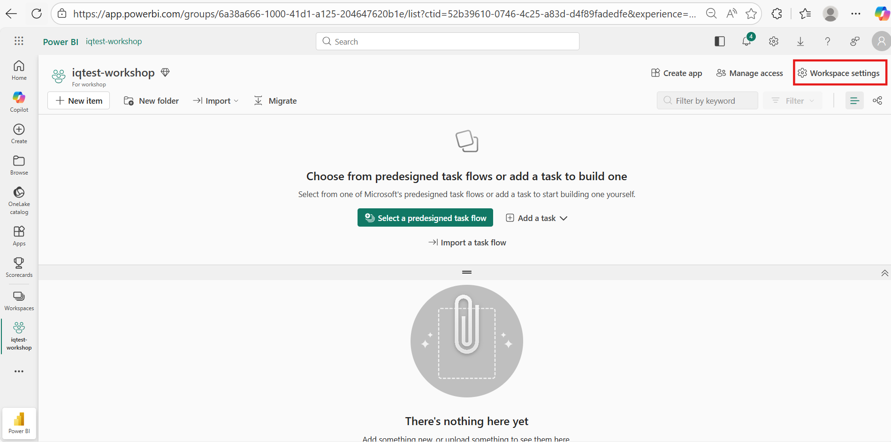
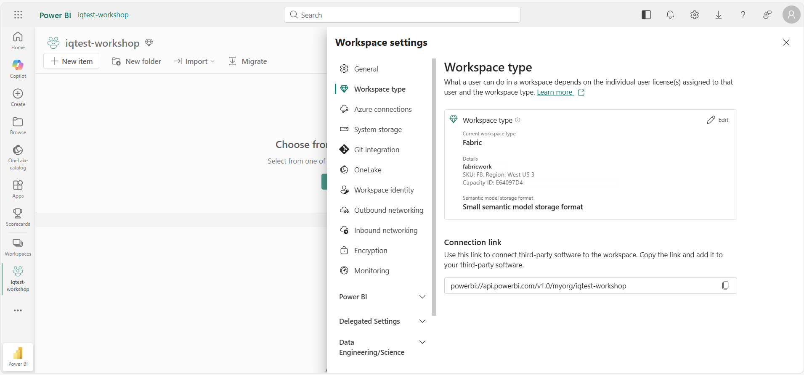

# Fabric Setup

Set up the Microsoft Fabric capacity and workspace that host the solution's data, Ontology, and Data Agent.

!!! note "Using Azure-Only Mode?"
    If you set `AZURE_ENV_ONLY=true` before running `azd up`, skip this page and go to [Configure dev environment](03-configure.md). Azure-only mode uses Azure SQL instead of Fabric.

!!! warning "Fabric IQ must be enabled on your tenant"
    Before continuing, confirm a Fabric admin has enabled Ontology, Graph, and Copilot tenant settings. See [Fabric IQ Tenant Settings](https://learn.microsoft.com/en-us/fabric/iq/ontology/overview-tenant-settings). These changes can take up to 15 minutes to propagate.

---

## How Fabric resources are provisioned

You need two Fabric resources: a **Fabric capacity** (F8 or higher) and a **workspace** linked to that capacity. In workshop mode, both can be auto-provisioned for you:

| Resource | When it is created | How to control it |
|---|---|---|
| **Fabric capacity** | During `azd up` | Auto-created by default. Set `AZURE_FABRIC_CAPACITY_NAME` to reuse an existing capacity; use `FABRIC_CAPACITY_SKU` to customize the SKU. |
| **Fabric workspace** | During the build script (step 02) | **Opt-in** — set `CREATE_FABRIC_WORKSPACE=true`, or pass an existing workspace ID via `FABRIC_WORKSPACE_ID` / `--fabric-workspace-id`. |

---

## Step 1  Choose your setup path

Pick the path that matches what you already have.

### Path A — Auto-provision everything (recommended)

Best for fresh environments. `azd up` creates the capacity; the build script creates the workspace.

Run **before** the build step:

```bash
azd env set CREATE_FABRIC_WORKSPACE true
```

Optional tuning:

```bash
# Change the capacity SKU (default: F2)
azd env set FABRIC_CAPACITY_SKU "F8"
```

Skip to [Step 2 — Verify tenant and workspace settings](#step-2-verify-tenant-and-workspace-settings) after the build runs.

### Path B — Reuse an existing Fabric capacity

You already have an F8+ capacity but need a new workspace. Set these **before** `azd up`:

```bash
azd env set AZURE_FABRIC_CAPACITY_NAME "your-capacity-name"
azd env set CREATE_FABRIC_WORKSPACE true
```

### Path C — Reuse an existing Fabric workspace

You already have a workspace linked to an F8+ capacity. Pass its ID:

```bash
azd env set FABRIC_WORKSPACE_ID "your-workspace-id"
```

Or pass it to the build script directly with `--fabric-workspace-id <id>`.

### Path D — Create capacity or workspace manually

Use this only if the auto-create paths don't fit (for example, your account lacks Azure permissions to create a capacity, or you need a specific region/config not exposed by the flags).

- Create a Fabric capacity: **[Create a Fabric capacity in Azure →](02a-create-fabric-capacity.md)**
- Create a Fabric workspace: **[Create a Fabric workspace →](02b-create-fabric-workspace.md)**

Then use Path C above to plug the workspace into the build.

---

## Step 2 — Verify tenant and workspace settings

Once the workspace exists (auto-created or manual), confirm it's configured correctly.

1. Open the workspace in [Microsoft Fabric](https://app.fabric.microsoft.com/).
2. Click the **Workspace settings** gear icon (⚙️) in the top-right.

    

3. Under **License info** (or **Workspace type**), verify:

    - [x] Workspace is assigned to a **Fabric capacity**
    - [x] Capacity SKU is **F8 or higher**

    

---

## Step 3 — Retrieve the workspace ID

Only required for **Path C** or **Path D** (auto-created workspaces are picked up by the build script automatically).

1. Open the workspace in Fabric.
2. The workspace ID is the GUID after `/groups/` in the URL:

    ```
    https://app.fabric.microsoft.com/groups/{workspace-id}/...
    ```

    

3. Copy it — you'll pass it to the build script in [Run the scenario](04-run-scenario.md).

!!! tip
    More detail: [Identify your workspace ID](https://learn.microsoft.com/en-us/fabric/admin/portal-workspace#identify-your-workspace-id).

---

## Summary

| Check |
|---|
| Fabric IQ tenant settings enabled |
| Fabric capacity provisioned (F8+) |
| Fabric workspace created and linked to the capacity |
| Workspace ID copied (Path C / Path D only) |

!!! success "Ready to continue"
    Proceed to [Configure dev environment →](03-configure.md).

---

[← Deploy Azure resources](01-deploy-azure.md) | [Configure dev environment →](03-configure.md)
