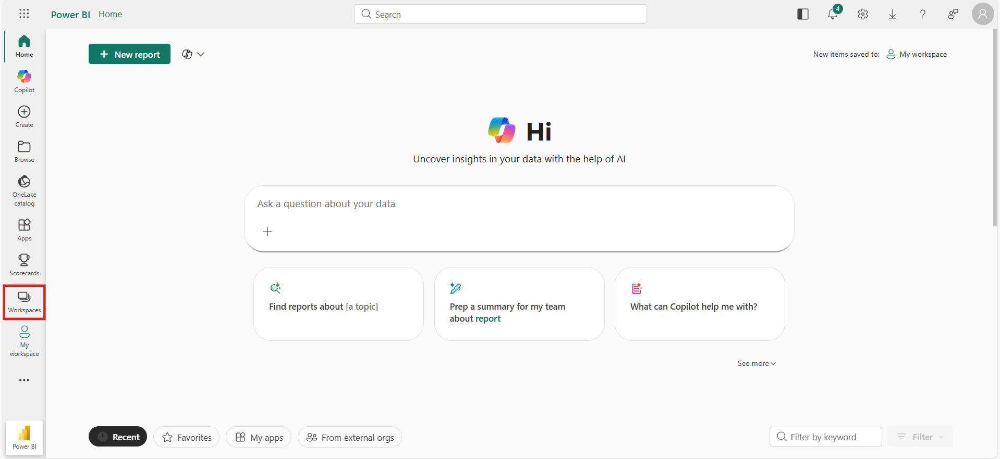
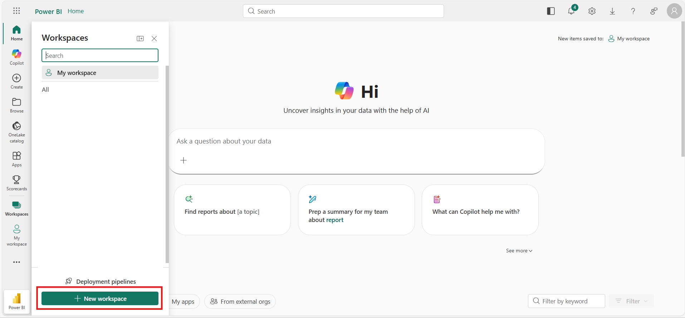
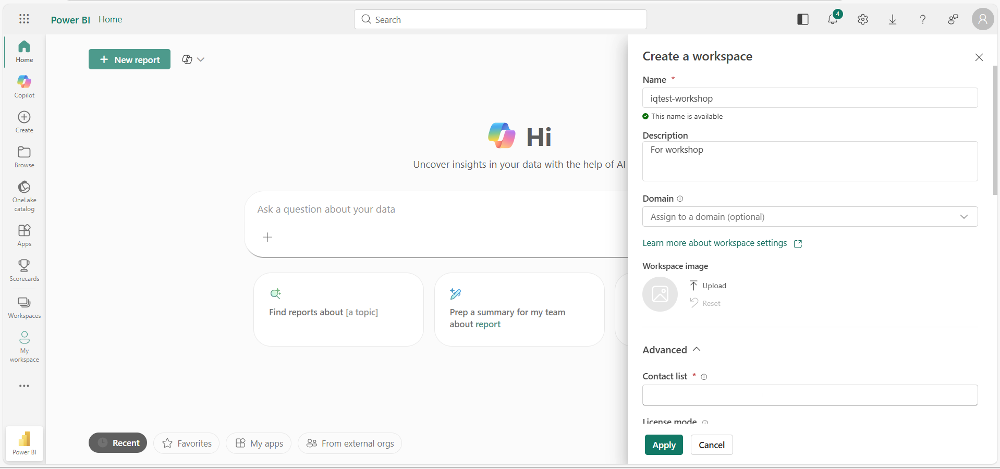
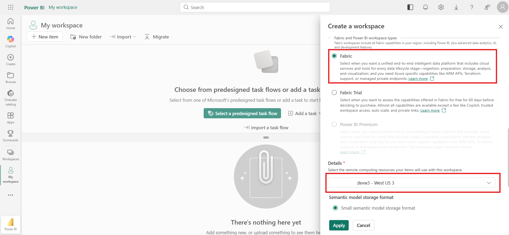
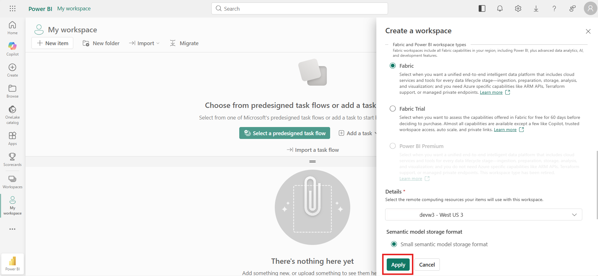

# Create a Fabric workspace

Create a Microsoft Fabric workspace and link it to your Fabric capacity.

## Prerequisites

- An active Azure subscription with permissions to create resources
- A Fabric capacity (F8+) — see [Create a Fabric capacity](02a-create-fabric-capacity.md) if you don't have one
- Workspace admin permissions

---

## Steps

1. Navigate to [Microsoft Fabric](https://app.fabric.microsoft.com/) and sign in with your Azure account.

3. Click **Workspaces** in the left navigation panel.

    

4. Click **+ New workspace**.

    

5. Fill in the workspace details:

    | Field | Value |
    |-------|-------|
    | **Name** | Enter a name (e.g., `iq-workshop`) |
    | **Description** | *(Optional)* A short description of the workspace |

    

6. Expand the **Advanced** section and configure the license:

    - Under **License mode**, select **Fabric capacity**.
    - Under **Capacity**, select the Fabric capacity you created (or an existing one).

    

7. Click **Apply** to create the workspace.

    

---

## Summary

You should now have a Fabric workspace created and linked to your Fabric capacity.

---

[← Fabric Setup](02-setup-fabric.md)