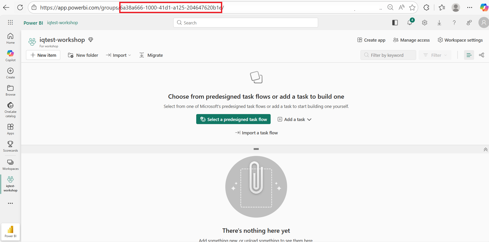

# Quick Deploy Guide [Option B]

## Prerequisites

- Azure subscription with Contributor access & Role Based Access Control access
- VS Code, Azure Developer CLI ([aka.ms/azd](https://aka.ms/azd)), Python 3.10+, Git
- For Fabric deployment: Microsoft Fabric workspace (F8+ capacity) with admin permissions
- [Microsoft ODBC Driver 18](https://learn.microsoft.com/en-us/sql/connect/odbc/download-odbc-driver-for-sql-server?view=sql-server-ver16)

## Choose Your Development Environment

Local Visual Studio Code: Open Visual Studio Code. From the File menu, select Open Folder and choose the folder where you want to deploy the workshop.

Or choose one of the options below:

[](https://codespaces.new/microsoft/agentic-applications-for-unified-data-foundation-solution-accelerator)
[](https://vscode.dev/azure/?vscode-azure-exp=foundry&agentPayload=eyJiYXNlVXJsIjogImh0dHBzOi8vcmF3LmdpdGh1YnVzZXJjb250ZW50LmNvbS9taWNyb3NvZnQvYWdlbnRpYy1hcHBsaWNhdGlvbnMtZm9yLXVuaWZpZWQtZGF0YS1mb3VuZGF0aW9uLXNvbHV0aW9uLWFjY2VsZXJhdG9yL3JlZnMvaGVhZHMvbWFpbi9pbmZyYS92c2NvZGVfd2ViIiwgImluZGV4VXJsIjogIi9pbmRleC5qc29uIiwgInZhcmlhYmxlcyI6IHsiYWdlbnRJZCI6ICIiLCAiY29ubmVjdGlvblN0cmluZyI6ICIiLCAidGhyZWFkSWQiOiAiIiwgInVzZXJNZXNzYWdlIjogIiIsICJwbGF5Z3JvdW5kTmFtZSI6ICIiLCAibG9jYXRpb24iOiAiIiwgInN1YnNjcmlwdGlvbklkIjogIiIsICJyZXNvdXJjZUlkIjogIiIsICJwcm9qZWN0UmVzb3VyY2VJZCI6ICIiLCAiZW5kcG9pbnQiOiAiIn0sICJjb2RlUm91dGUiOiBbImFpLXByb2plY3RzLXNkayIsICJweXRob24iLCAiZGVmYXVsdC1henVyZS1hdXRoIiwgImVuZHBvaW50Il19)


---

> Note: Please use this optional prompt if you would like to use GitHub Copilot to run the workshop: 
```
Can you please follow the step by step in https://microsoft.github.io/agentic-applications-for-unified-data-foundation-solution-accelerator/deployment-guide/ and follow Option A for me. My Fabric Workspace id = <YOUR_FABRIC_WORKSPACE_ID>. Pass it using the --fabric-workspace-id parameter when running the build solution script.
Important instructions:
Do NOT make any code changes to the repository files. 
Only follow the deployment guide instructions exactly as documented. 
Run the commands step by step and wait for each to complete before proceeding.
If I encounter any errors or issues, help me troubleshoot and resolve them before continuing.
Explain what each step does before running it.
If a step fails, suggest solutions based on the error message. 
```

---

## Full Deployment (Fabric + Foundry)

### 1. Configure Fabric workspace

#### 1a. Create a Fabric capacity in Azure

!!! tip "Already have a Fabric capacity?"
    If you already have a Fabric capacity (F8+), you can **skip this step** and use your existing capacity.

Follow the instructions here:
**[Create a Fabric capacity in Azure →](./01-deploy/02a-create-fabric-capacity.md)**

#### 1b. Create a Fabric workspace

!!! tip "Already have a Fabric workspace?"
    If you already have a Fabric workspace linked to a Fabric capacity, you can **skip this step** and use your existing workspace.

Follow the instructions here:
**[Create a Fabric workspace →](./01-deploy/02b-create-fabric-workspace.md)**

#### 1c. Verify workspace settings

!!! warning "Fabric IQ must be enabled"
    Ensure that Fabric IQ is enabled on your tenant before proceeding. This setting is configured in the **Fabric Admin Portal**.
    
    1. Go to [Fabric Admin Portal](https://app.fabric.microsoft.com/admin-portal) → **Tenant settings**.
    2. Search for and enable both of the following preview features:
        - **Ontology (preview)**
        - **Graph (preview)**
        - **Data agent item types (preview)**
        - **Copilot and Azure OpenAI Service**
    3. These settings may take a upto 15 minutes to take effect.
    
    For detailed instructions, refer to the official documentation: [Fabric IQ Tenant Settings](https://learn.microsoft.com/en-us/fabric/iq/ontology/overview-tenant-settings).

1. Open your newly created workspace or an existing workspace.
2. Click the **Workspace settings** gear icon (⚙️) in the top-right area.
3. Go to **License info** and verify:
    - [x] The workspace is assigned to a **Fabric capacity**
    - [x] The capacity SKU is **F8** or higher

### 2. Clone the repository

```bash
git clone https://github.com/microsoft/agentic-applications-for-unified-data-foundation-solution-accelerator.git
```

```bash
cd agentic-applications-for-unified-data-foundation-solution-accelerator
```

### 3. Deploy Azure resources

```bash
azd auth login
```

```bash
az login
```

> **VS Code Web users:** Use `az login --use-device-code` since browser-based login is not supported in VS Code Web.

Register the Microsoft Cognitive Services resource provider (required if not already registered on your subscription):

```bash
az provider register --namespace Microsoft.CognitiveServices
```

```bash
azd up
```


When you start the deployment, you will need to set the following parameters: 

| **Setting**                                 | **Description**                                                                                           | **Default value**      |
| ------------------------------------------- | --------------------------------------------------------------------------------------------------------- | ---------------------- |
| **Environment Name**                        | A unique **3–20 character alphanumeric value** used to prefix resources, preventing conflicts with others.            | env\_name              |
| **Azure Subscription**                      | The Azure subscription to deploy resources into. Only prompted if you have multiple subscriptions.        | *(auto-selected if only one)* |
| **Azure Region**                            | The region where resources will be created.                                                               | *(empty)*              |
| **AI Model Location**                        | The region where AI model will be created            | *(empty)              |

*Different tenant? Use: `azd auth login --tenant-id <tenant-id>`*


### 4. Setup Python environment

```bash
python -m venv .venv
```

```bash
.venv\Scripts\activate   # or: source .venv/bin/activate
```

```bash
pip install uv && uv pip install -r scripts/requirements.txt
```

### 5. Build the solution

#### Retrieve your Fabric workspace ID

You will need your workspace ID to pass as a parameter when building the solution.

1. Open your workspace in [Microsoft Fabric](https://app.fabric.microsoft.com/).
2. Look at the URL — the workspace ID is the GUID that appears after `/groups/`:

    ```
    https://app.fabric.microsoft.com/groups/{workspace-id}/...
    ```

    

3. Copy the workspace ID.

!!! tip "Finding the workspace ID"
    For more details, refer to the Microsoft documentation: [Identify your workspace ID](https://learn.microsoft.com/en-us/fabric/admin/portal-workspace#identify-your-workspace-id).

#### Run the build

```bash
az login
```

> **VS Code Web users:** Use `az login --use-device-code` since browser-based login is not supported in VS Code Web.

```bash
python scripts/00_build_solution.py --from 02 --fabric-workspace-id <your-workspace-id>
```

> **Note:** If you omit `--fabric-workspace-id`, the script will prompt you for it interactively. 
> Press **Enter** key to start or **Ctrl+C** to cancel the process.

### 6. Test the agent

```bash
python scripts/08_test_agent.py
```

**Sample questions to try:**

- "What is the average score from inspections?"
- "What constitutes a failed inspection?"
- "Do any inspections violate quality control standards in our Inspection Procedures?"


<!-- ### 7. Create the Ontology

Follow the step-by-step guide to create an Ontology in Microsoft Fabric for your scenario:

👉 [Create Ontology Guide](./01-deploy/05-ontology-creation.md)

This sets up entity types (Tickets, Inspections), data bindings from your Lakehouse tables, and relationships between them. -->

### 7. Test the Fabric Data Agent

1. Go to your [Microsoft Fabric](https://app.fabric.microsoft.com/) workspace
2. Select "New item" → Search for "Data Agent" → select data agent, provide a name and click create
3. Add data source → Select your Ontology resource for this workshop
4. Click Agent instructions from top menu and add the below agent instructions:
    ```
    You are a helpful assistant that can answer user questions using data.
    Support group by in GQL.
    ```
5. Click Publish from the top menu and select Publish. 

> Note: The Ontology set up may take up to 15 minutes so retry after some time if you don't see good responses. 

**Sample questions to try:**

- "How many tickets are high priority"
- "What is the average score from inspections?"
- Show tickets grouped by status.

### 8. Deploy and launch the application

```bash
azd env set AZURE_ENV_DEPLOY_APP true
```

```bash
azd up
```

### 9. Set up app permissions

```bash
python scripts/00_build_solution.py --from 09
```

> **Note:** Press **Enter** key to start or **Ctrl+C** to cancel the process.

After the agent configuration & API permission set up completes, open the app URL shown in the output.

### 10. Customize for Your Industry (Optional)

Follow steps in this page to  [Customize for your use case](./02-customize/index.md).


----------

**Repository:** [github.com/microsoft/agentic-applications-for-unified-data-foundation-solution-accelerator](https://github.com/microsoft/agentic-applications-for-unified-data-foundation-solution-accelerator)
