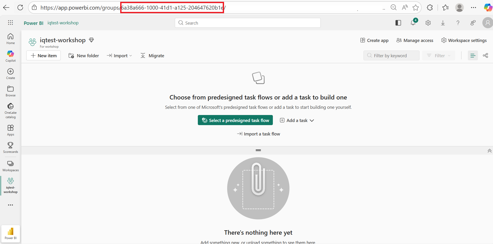

# Quick Deploy Guide [Option A]

## Prerequisites

- Azure subscription with Contributor access & Role Based Access Control access
- [Visual Studio Code](https://code.visualstudio.com/download)
- [Azure Developer CLI (azd)](https://learn.microsoft.com/azure/developer/azure-developer-cli/install-azd)
- [Python 3.10 to 3.13](https://www.python.org/downloads/)
- [Git](https://git-scm.com/downloads)
- [Microsoft ODBC Driver 18](https://learn.microsoft.com/en-us/sql/connect/odbc/download-odbc-driver-for-sql-server?view=sql-server-ver16)

## Choose Your Development Environment

Local Visual Studio Code: Open Visual Studio Code. From the File menu, select Open Folder and choose the folder where you want to deploy the workshop.

Or choose one of the options below:

[](https://codespaces.new/microsoft/agentic-applications-for-unified-data-foundation-solution-accelerator)
[](https://vscode.dev/azure/?vscode-azure-exp=foundry&agentPayload=eyJiYXNlVXJsIjogImh0dHBzOi8vcmF3LmdpdGh1YnVzZXJjb250ZW50LmNvbS9taWNyb3NvZnQvYWdlbnRpYy1hcHBsaWNhdGlvbnMtZm9yLXVuaWZpZWQtZGF0YS1mb3VuZGF0aW9uLXNvbHV0aW9uLWFjY2VsZXJhdG9yL3JlZnMvaGVhZHMvbWFpbi9pbmZyYS92c2NvZGVfd2ViIiwgImluZGV4VXJsIjogIi9pbmRleC5qc29uIiwgInZhcmlhYmxlcyI6IHsiYWdlbnRJZCI6ICIiLCAiY29ubmVjdGlvblN0cmluZyI6ICIiLCAidGhyZWFkSWQiOiAiIiwgInVzZXJNZXNzYWdlIjogIiIsICJwbGF5Z3JvdW5kTmFtZSI6ICIiLCAibG9jYXRpb24iOiAiIiwgInN1YnNjcmlwdGlvbklkIjogIiIsICJyZXNvdXJjZUlkIjogIiIsICJwcm9qZWN0UmVzb3VyY2VJZCI6ICIiLCAiZW5kcG9pbnQiOiAiIn0sICJjb2RlUm91dGUiOiBbImFpLXByb2plY3RzLXNkayIsICJweXRob24iLCAiZGVmYXVsdC1henVyZS1hdXRoIiwgImVuZHBvaW50Il19)


---

> Note: Please use this optional prompt if you would like to use GitHub Copilot to run the workshop: 
```
Can you please follow the step by step in https://microsoft.github.io/agentic-applications-for-unified-data-foundation-solution-accelerator/quick-deploy/deployment-guide-optionA/ for me. My Fabric Workspace id = <YOUR_FABRIC_WORKSPACE_ID>. Pass it using the --fabric-workspace-id parameter when running the build solution script.
Important instructions:
Do NOT make any code changes to the repository files. 
Only follow the deployment guide instructions exactly as documented. 
Run the commands step by step and wait for each to complete before proceeding.
If I encounter any errors or issues, help me troubleshoot and resolve them before continuing.
Explain what each step does before running it.
If a step fails, suggest solutions based on the error message. 
```

---

## Full Deployment (Fabric + Foundry)

### 1. Configure Fabric workspace

#### 1a. Enable Ontology and required features in Fabric Admin Portal

!!! warning "Fabric IQ must be enabled"
    You **must** enable Ontology and related preview features in the Fabric Admin Portal before proceeding. Without these settings, the Ontology item will not appear in your workspace and the Data Agent will not function.

Follow these steps to enable the required tenant settings:

1. Navigate to the [Fabric Admin Portal](https://app.fabric.microsoft.com/admin-portal).
    - If you don't see the Admin Portal option, ensure you have **Fabric Admin** or **Global Admin** permissions on your tenant.

2. In the left-hand navigation pane, select **Tenant settings**.

3. **Enable Ontology (preview)**:
    - In the Tenant settings page, use the search bar at the top and search for **Ontology**.
    - Locate the **Ontology (preview)** setting.
    - Toggle the setting to **Enabled**.
    - Choose whether to enable it for **The entire organization** or for **Specific security groups** based on your needs.
    - Click **Apply**.

4. **Enable Graph (preview)**:
    - Search for **Graph** in the Tenant settings search bar.
    - Locate the **Graph (preview)** setting.
    - Toggle the setting to **Enabled**.
    - Choose the appropriate scope (entire organization or specific security groups).
    - Click **Apply**.

5. **Enable Copilot and Azure OpenAI Service**:
    - Search for **Copilot** in the Tenant settings search bar.
    - Locate the **Copilot and Azure OpenAI Service** setting.
    - Toggle the setting to **Enabled**.
    - Choose the appropriate scope.
    - Click **Apply**.

!!! note "Propagation delay"
    These settings may take **up to 15 minutes** to take effect across your tenant. If you don't see the Ontology or Data Agent options in your workspace immediately, wait and refresh the page.

For detailed instructions, refer to the official documentation: [Fabric IQ Tenant Settings](https://learn.microsoft.com/en-us/fabric/iq/ontology/overview-tenant-settings).

#### 1b. Create a Fabric capacity in Azure

!!! tip "Already have a Fabric capacity?"
    If you already have a Fabric capacity (F8+), you can **skip this step** and use your existing capacity.

Follow the instructions here:
**[Create a Fabric capacity in Azure →](../01-deploy/02a-create-fabric-capacity.md)**

#### 1c. Create a Fabric workspace

!!! tip "Already have a Fabric workspace?"
    If you already have a Fabric workspace linked to a Fabric capacity, you can **skip this step** and use your existing workspace.

Follow the instructions here:
**[Create a Fabric workspace →](../01-deploy/02b-create-fabric-workspace.md)**

#### 1d. Verify workspace settings

1. Open your newly created workspace or an existing workspace.
2. Click the **Workspace settings** gear icon (⚙️) in the top-right area.
3. Go to **License info** and verify:
    - [x] The workspace is assigned to a **Fabric capacity**
    - [x] The capacity SKU is **F8** or higher

### 2. Clone the repository

```bash
git clone https://github.com/microsoft/agentic-applications-for-unified-data-foundation-solution-accelerator.git
```

```bash
cd agentic-applications-for-unified-data-foundation-solution-accelerator
```

### 3. Deploy Azure resources

```bash
azd auth login
```

```bash
az login
```

> **VS Code Web users:** Use `az login --use-device-code` since browser-based login is not supported in VS Code Web.

Register the required resource providers (if not already registered on your subscription):

**Register Microsoft Cognitive Services:**
```bash
az provider register --namespace Microsoft.CognitiveServices
```

**Register Microsoft App:**
```bash
az provider register --namespace Microsoft.App
```

**Register Microsoft App Configuration:**
```bash
az provider register --namespace Microsoft.AppConfiguration
```

**NOTE:** If you are running the latest azd version (version 1.23.9), please run the following command. 
```bash 
azd config set provision.preflight off
```

**Run the deployment:**

Run the following command to provision all required Azure resources:

```bash
azd up
```


When you start the deployment, you will need to set the following parameters: 

| **Setting**                                 | **Description**                                                                                           | **Default value**      |
| ------------------------------------------- | --------------------------------------------------------------------------------------------------------- | ---------------------- |
| **Environment Name**                        | A unique **3–20 character alphanumeric value** used to prefix resources, preventing conflicts with others.            | env\_name              |
| **Azure Subscription**                      | The Azure subscription to deploy resources into. Only prompted if you have multiple subscriptions.        | *(auto-selected if only one)* |
| **Azure Region**                            | The region where resources will be created.                                                               | *(empty)*              |
| **AI Model Location**                        | The region where AI model will be created            | *(empty)              |

*Different tenant? Use: `azd auth login --tenant-id <tenant-id>`*


### 4. Setup Python environment

```bash
python -m venv .venv
```

```bash
.venv\Scripts\activate   # or: source .venv/bin/activate
```

```bash
pip install uv && uv pip install -r scripts/requirements.txt
```

### 5. Build the solution

#### Retrieve your Fabric workspace ID

You will need your workspace ID to pass as a parameter when building the solution.

1. Open your workspace in [Microsoft Fabric](https://app.fabric.microsoft.com/).
2. Look at the URL — the workspace ID is the GUID that appears after `/groups/`:

    ```
    https://app.fabric.microsoft.com/groups/{workspace-id}/...
    ```

    

3. Copy the workspace ID.

!!! tip "Finding the workspace ID"
    For more details, refer to the Microsoft documentation: [Identify your workspace ID](https://learn.microsoft.com/en-us/fabric/admin/portal-workspace#identify-your-workspace-id).

#### Run the build

```bash
az login
```

> **VS Code Web users:** Use `az login --use-device-code` since browser-based login is not supported in VS Code Web.

```bash
python scripts/00_build_solution.py --from 02 --fabric-workspace-id <your-workspace-id>
```

> **Note:** If you omit `--fabric-workspace-id`, the script will prompt you for it interactively. 
> Press **Enter** key to start or **Ctrl+C** to cancel the process.

### 6. Test the agent

```bash
python scripts/07_test_agent.py
```

**Sample questions to try:**

- "What is the average score from inspections?"
- "What constitutes a failed inspection?"
- "Do any inspections violate quality control standards in our Inspection Procedures?"


<!-- ### 7. Create the Ontology

Follow the step-by-step guide to create an Ontology in Microsoft Fabric for your scenario:

👉 [Create Ontology Guide](./01-deploy/05-ontology-creation.md)

This sets up entity types (Tickets, Inspections), data bindings from your Lakehouse tables, and relationships between them. -->

### 7. Test the Fabric Data Agent

1. Go to your [Microsoft Fabric](https://app.fabric.microsoft.com/) workspace.
2. Open the Data Agent named `dataagent_<solution-name>_<suffix>`.
3. If you do not see the Data Agent immediately, wait a few minutes and refresh the workspace.
4. Ask the sample questions below.

> Note: The Ontology setup may take up to 15 minutes to fully propagate, so retry after some time if you do not see good responses.

**Sample questions to try:**

- "How many tickets are high priority"
- "What is the average score from inspections?"
- Show tickets grouped by status.

### 8. Launch the application

The web application is already deployed during the initial `azd up` deployment. Open the app URL shown in the deployment output in your browser.

### 9. Rerun with Fabric Data Agent (Optional)

By default, the app queries your data using direct SQL. Once you've tried out the application, you can switch to using the **Fabric Data Agent**.

To make the switch, rerun the build starting from step 06 with the `--use-data-agent` flag:

```bash
python scripts/00_build_solution.py --from 06 --use-data-agent
```

This swaps out the default query method and connects the app to the Fabric Data Agent instead.

> **Note:** The Fabric Data Agent must already exist (it was created in step 02 and you verified it in step 7). Make sure it's published by checking your [Microsoft Fabric](https://app.fabric.microsoft.com/) workspace.

After the rebuild, test the updated agent or refresh the web app to see the difference:

```bash
python scripts/07_test_agent.py
```

### 10. Customize for Your Industry (Optional)

Follow steps in this page to  [Customize for your use case](../02-customize/index.md).

### Bring Your Own Data (Optional)

Instead of using AI-generated sample data, you can run the entire lab with **your own data**.

1. Place your files in `data/customdata/`:

    ```
    data/customdata/
    ├── tables/
    │   └── *.csv                   # One CSV per table
    └── documents/
        └── *.pdf                   # PDF documents for AI Search
    ```

    > The `config/` folder (with `ontology_config.json`) is **auto-generated** from your CSV files. See [data/customdata/README.md](https://github.com/microsoft/agentic-applications-for-unified-data-foundation-solution-accelerator/blob/main/data/customdata/README.md) for details.

2. Run the build with `--custom-data`:

    ```bash
    python scripts/00_build_solution.py --custom-data data/customdata --fabric-workspace-id <your-workspace-id>
    ```

    You will be prompted for your **Industry** and **Use Case**. The script will auto-generate the config, skip step 01 (AI data generation), and run the remaining pipeline steps.


----------

**Repository:** [github.com/microsoft/agentic-applications-for-unified-data-foundation-solution-accelerator](https://github.com/microsoft/agentic-applications-for-unified-data-foundation-solution-accelerator)
